<div align="center">
  
#  Namaste, I'm **Sagar Gupta**


</div>

---

## 🧑‍💻 About Me

```python
class SagarGupta:
    def __init__(self):
        self.username = "GuptaSigma"
        self.location = "Mumbai, India 🇮🇳"
        self. education = "Computer Science Undergraduate 🎓"
        self. interests = ["AI/ML", "Backend Development", "NLP", "Data Science"]
        self.current_focus = "Building ML-powered web applications"
        self.motto = "Focused on practical projects — no fake skills"
    
    def say_hi(self):
        print("Thanks for dropping by! Let's build something amazing together 🚀")

me = SagarGupta()
me.say_hi()
```


### 🔍 Quick Facts
- 🤖 **AI/ML & Backend Enthusiast**
- 💻 Building **real-world machine learning powered web applications**
- 📚 Learning by **building and deploying** actual projects
- 🎯 Actively improving **problem-solving skills**
- 🔬 Experience with **Scikit-learn, NLP, Flask, Streamlit**
- 🌱 Currently exploring **Deep Learning & Advanced NLP**

<br clear="right"/>

---

## 🛠️ Tech Stack & Skills

<div align="center">

### 🌐 Web & Backend Development


### 🤖 AI / Machine Learning


### 🗄️ Database & Tools


</div>

<div align="center">
  
  
  
  
  
</div>

---

## 📊 GitHub Analytics

<div align="center">
  
  
</div>

<div align="center">
  
</div>

<div align="center">
  
</div>

---

## 🏆 GitHub Trophies

<div align="center">
  
</div>

---

## 🚀 Featured Projects

<div align="center">

### 🔹 SMART Resume Analyzer


**An intelligent resume screening system powered by Machine Learning**


</div>

#### ✨ Features: 
- ✅ **ML-based Job Matching** - Intelligent resume-job description matching
- ✅ **TF-IDF Similarity Scoring** - Advanced text similarity analysis
- ✅ **Real-time Predictions** - Instant candidate screening results
- ✅ **Email Automation** - Automated communication with candidates
- ✅ **Database Integration** - Efficient data storage and retrieval

#### 🎯 Technical Highlights:
- Used **Natural Language Processing** for text preprocessing
- Implemented **TF-IDF vectorization** for feature extraction
- Applied **Cosine Similarity** for resume-job matching
- Built responsive **Flask backend** with RESTful APIs

<div align="center">
  
[](https://github.com/GuptaSigma/smart-resume-analyzer)
[](#)

</div>

---

<div align="center">

### 🔹 Spam Email Detector


**Email spam classification system using Machine Learning**


</div>

#### ✨ Features:
- ✅ **Naive Bayes Classification** - Efficient spam detection algorithm
- ✅ **Interactive Web Interface** - Built with Streamlit
- ✅ **Model Performance Metrics** - Precision, Recall & F1-score evaluation
- ✅ **Real-time Predictions** - Instant spam/ham classification
- ✅ **Text Preprocessing Pipeline** - Comprehensive NLP preprocessing

#### 🎯 Technical Highlights:
- Achieved **95%+ accuracy** on test dataset
- Implemented **text cleaning** and **tokenization**
- Used **CountVectorizer** for feature extraction
- Deployed interactive **Streamlit** web application

<div align="center">
  
[](https://github.com/GuptaSigma/spam-email-detector)
[](#)

</div>

---

## 💼 What I'm Currently Working On

```mermaid
graph LR
    A[🧠 Learning] --> B[Deep Learning]
    A --> C[Advanced NLP]
    A --> D[MLOps]
    E[💻 Building] --> F[ML Web Apps]
    E --> G[Backend APIs]
    E --> H[Data Pipelines]
```

<div align="center">



</div>

- 🔭 Exploring **Deep Learning** frameworks (TensorFlow, PyTorch)
- 🌱 Learning **Advanced NLP** techniques (Transformers, BERT)
- 👯 Open to collaborate on **AI/ML projects**
- 💬 Ask me about **Python, Machine Learning, Flask, NLP**
- 📫 Reach me at:  **sagargupta585845@gmail.com**

---

## 📈 Coding Activity

<!--START_SECTION:waka-->
<!--END_SECTION:waka-->

<div align="center">
  
</div>

---

## 🤝 Connect With Me

<div align="center">

[](https://linkedin.com/in/YOUR-LINKEDIN-USERNAME)
[](mailto:sagargupta585845@gmail.com)
[](https://github.com/GuptaSigma)
[](#)

</div>

---

<div align="center">

### 📊 Profile Stats


</div>

---

<div align="center">
  
### 💡 *"Building AI solutions that matter, one project at a time"*


### ⭐ From [GuptaSigma](https://github.com/GuptaSigma)

**Show some ❤️ by starring my repositories! **

</div>
